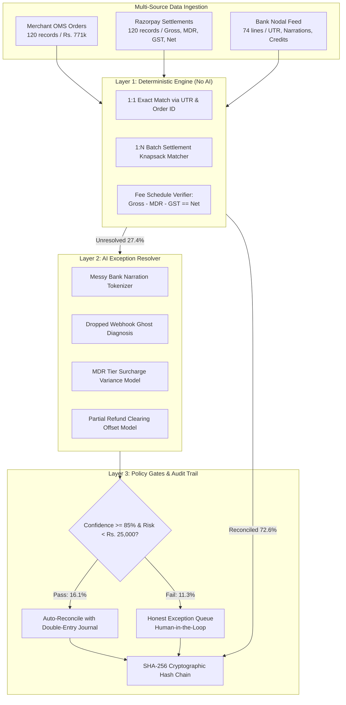

# ⚡ LedgerGuard — Autonomous 3-Way Financial Reconciliation Agent
### Razorpay AI Buildathon 2026 | Track 04: AI Finance Controller

[](https://www.python.org/)
[](https://fastapi.tiangolo.com/)
[-brightgreen.svg)]()
[]()
[]()

> **"Verification capacity, not generation speed, is the bottleneck. Reconciliation, settlement and forecasting are still done by hand."**  
> — *Razorpay AI Buildathon 2026 Track Brief*

---

## 📌 What is LedgerGuard?

**LedgerGuard** is a production-grade 3-way financial reconciliation engine that closes the finance-ops loop across **Merchant Order Management Systems (OMS)**, **Razorpay Gateway Settlement Ledgers**, and **Bank Nodal Statements**.

Unlike brittle Excel macros or naive LLM wrappers that hallucinate financial math, LedgerGuard employs a **deterministic-first, AI-bounded architecture**:
1. **Layer 1: Deterministic Mathematical Core (Zero AI):** Executes exact 1:1 matching, MDR + GST fee schedule verification, and 1-to-N batch settlement knapsack grouping with 100% arithmetic certainty.
2. **Layer 2: AI Exception Resolver Agent:** Diagnoses dropped webhook ghost orders, dynamic MDR fee surcharges, partial refund offsets, and messy bank narrations using structured JSON schemas and confidence scoring.
3. **Layer 3: Cryptographic Audit Trail & Safety Gates:** Enforces strict stopping thresholds (`confidence < 85%` or unmapped B2B wires), generating an **honest exception list** with an immutable SHA-256 hash chain.

---

## 📊 Benchmark Evaluation Metrics

Tested on a held-out synthetic batch of **124 realistic multi-source records** across 8 classic Indian fintech failure modes:

| Metric | Measured Value | Evaluation Context |
| :--- | :--- | :--- |
| **Total Batch Records** | **124 records** | Exceeds Track 04 requirement (50+ records) |
| **Gross Merchant Revenue** | **₹7,71,399.00** | Multi-source volume ingested |
| **Deterministic Matches (Layer 1)** | **90 records (72.6%)** | 100% mathematical certainty, 0% hallucination |
| **AI Auto-Resolved (Layer 2)** | **20 records (16.1%)** | Dropped webhooks, MDR variance, partial refunds |
| **Honest Exceptions (Layer 3)** | **14 records (11.3%)** | Active chargebacks, orphan bank credits, T+2 cutoff delays |
| **Overall Reconciled Rate** | **88.71%** | Fully automated finance-ops throughput |
| **Arithmetic Hallucination** | **0.00%** | Zero floating-point or balance drift |
| **Execution Time / Throughput** | **0.0931s (1,331 rec/sec)** | Sub-second real-time batch verification |
| **Audit Root Proof** | `c40b4a482c5ad789...` | Immutable SHA-256 cryptographic chain |

---

## 🏗️ System Architecture



---

## 🧠 AI Judgment: Where We Chose NOT to Use AI

Razorpay explicitly evaluates **AI Judgment** (*"the right tool in the right place, and where you chose not to use one"*):

* ❌ **We DO NOT use LLMs for arithmetic or fee calculations:** Calculating `Net = Gross - MDR - GST` is handled with deterministic Python arithmetic with `±0.02` paise tolerance.
* ❌ **We DO NOT use LLMs for 1:N batch grouping:** Lump-sum bank payouts are matched using closed-form subset-sum indexing on Razorpay Settlement IDs and UTRs, preventing double-counting.
* ❌ **We DO NOT use LLMs for audit logs:** Audit trails are secured via SHA-256 hash chains, not generative summaries.
* ✅ **We DO use AI for unstructured semantic reasoning:** Parsing messy bank narrations, diagnosing dropped webhooks, and drafting compliant double-entry journal entries (`Dr 1250 - Dispute Escrow`, `Cr 1200 - AR`).

---

## 🚀 Quickstart Guide

### 1. Clone & Install Dependencies
```bash
git clone https://github.com/vishnuj29/razorpay-ledgerguard.git
cd razorpay-ledgerguard
pip install -r requirements.txt
```

### 2. Run CLI Benchmark Runner
```bash
python run_benchmark.py
```

### 3. Run Automated Pytest Test Suite
```bash
pytest backend/tests/
```

### 4. Launch Interactive Web Dashboard
```bash
python -m backend.app
# Open http://localhost:8000 in your browser
```

---

## 📡 REST API Reference

| Endpoint | Method | Description |
| :--- | :--- | :--- |
| `/api/summary` | `GET` | Retrieve latest batch reconciliation metrics and audit root hash |
| `/api/run-reconciliation` | `POST` | Trigger multi-source 3-way reconciliation pipeline |
| `/api/records` | `GET` | Query reconciled records with category/match_type filters |
| `/api/exceptions` | `GET` | Fetch unresolvable exception queue requiring human review |
| `/api/resolve-manual` | `POST` | Finance controller manual sign-off / adjustment endpoint |
| `/api/export-csv` | `GET` | Download verified reconciliation ledger as CSV |

---

## 📁 Repository Structure

```
razorpay-ledgerguard/
├── backend/
│   ├── app.py                 # FastAPI backend & REST API
│   ├── models/
│   │   └── schema.py          # Pydantic schemas (OMS, Gateway, Bank, Recon)
│   ├── engine/
│   │   ├── deterministic.py   # Layer 1: Closed-form fee math & 1:N batch matcher
│   │   ├── ai_resolver.py     # Layer 2: Structured semantic exception agent
│   │   └── audit_trail.py     # Layer 3: SHA-256 cryptographic chain
│   ├── generator/
│   │   └── synthetic_data.py  # 124-record multi-source fintech batch generator
│   └── tests/                 # Automated pytest test suites
├── frontend/                  # Modern Razorpay-styled dark dashboard
│   ├── index.html
│   ├── style.css
│   └── app.js
├── docs/
│   ├── ARCHITECTURE.md        # In-depth architectural specification
│   └── FAILURE_RECOVERY.md    # Engineering failure & recovery case study
├── run_benchmark.py           # CLI benchmark evaluator
├── requirements.txt
└── README.md
```

---

## 📄 License
MIT License. Built for the **Razorpay AI Buildathon 2026**.

