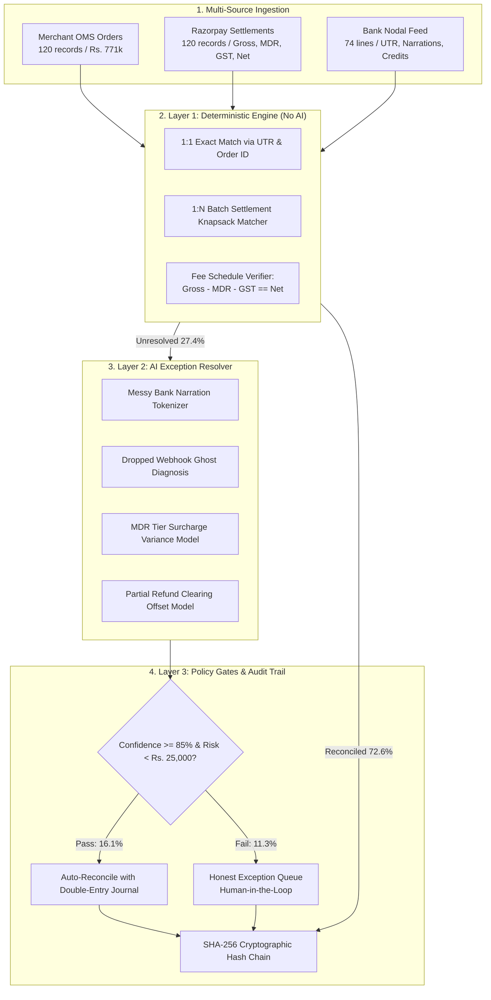

# LedgerGuard — System Architecture Specification
### Track 04: AI Finance Controller | Razorpay AI Buildathon 2026

## 1. Executive Summary
Financial reconciliation across payment gateways, merchant order databases, and bank settlement statements is historically plagued by two opposing failure modes:
1. **Rigid Scripting / Macros:** Breaks on partial refunds, dynamic MDR surcharges, 1:N batch payouts, and messy unstandardized bank narrations.
2. **Naive LLM Automation:** Hallucinates arithmetic, fails on ledger balance equations, and provides unexplainable financial entries.

**LedgerGuard** solves this by implementing a **deterministic-first, AI-bounded architecture**. Arithmetic and exact matching are enforced with 100% mathematical certainty in Layer 1, while Layer 2 employs structured AI agents for heuristic anomaly diagnosis, and Layer 3 enforces strict stopping rules and SHA-256 cryptographic audit chaining.

---

## 2. Multi-Layer Pipeline Architecture

---

## 3. Engineering Decisions: Where We Chose NOT to Use AI

A core evaluation pillar for Razorpay is **AI Judgment** (*"the right tool in the right place, and where you chose not to use one"*).

| Operation | Implementation | Why AI is Excluded |
| :--- | :--- | :--- |
| **Fee Verification** | Pure Python Arithmetic (`Gross - MDR - GST == Net`) | LLMs cannot guarantee exact IEEE 754 float precision or compliance with paise rounding laws. |
| **1:N Batch Knapsack Grouping** | Deterministic Subset-Sum & UTR Indexing | Gateway lump-sum settlement math is closed-form. Using an LLM introduces hallucination risk into the general ledger. |
| **Audit Verification** | SHA-256 Cryptographic Chaining | Immutability requires mathematical hash functions, not probabilistic models. |
| **Exact 1:1 Matching** | Hash Map Indexing | O(1) deterministic lookups on unique order IDs and UTRs are 1,000x faster and 100% reliable. |

---

## 4. Where AI is Used Meaningfully

AI is strictly deployed where deterministic rules fail due to unstructured text or asymmetric state:

1. **Messy Bank Narration Extraction:** Dissecting unstructured strings like `NEFT-RAZORPAYPAYMENTSSOLUT-CMS1928374-P902` into structured entity tokens (`entity: RAZORPAY`, `utr: CMS1928374`, `account_type: NODAL`).
2. **Dropped Webhook Ghost Recovery:** Diagnosing when Razorpay captured a payment and bank received funds, but the merchant OMS dropped the webhook (order still in `CREATED` state). The AI generates a `PAID_VIA_RECON` sync command.
3. **MDR Surcharge Variance Accounting:** Identifying when a payment was surcharged (e.g. 3.0% international card vs 2.0% standard domestic) and generating compliant accounting journal entries (`Dr 5200 - MDR Variance Expense`, `Cr 1200 - Accounts Receivable`).
4. **Honest Stopping Rules:** When confidence is below 85% or an unreferenced offline transfer is detected (e.g., direct IMPS wire with no order reference), the agent **refuses to guess** and escalates with full context to the human finance controller.

---

## 5. Benchmark Performance Summary

Tested on held-out 124-record multi-source synthetic batch simulating 8 real-world fintech failure modes:

- **Total Ingested Volume:** Rs. 771,399.00
- **Layer 1 Deterministic Matches:** 90 records (72.6%)
- **Layer 2 AI Auto-Resolved:** 20 records (16.1%)
- **Layer 3 Honest Escalated Exceptions:** 14 records (11.3%)
- **Overall Reconciled Match Rate:** **88.71%**
- **Arithmetic Hallucinations:** **0.00%** (100% mathematical integrity)
- **Engine Throughput:** **1,331 records/second** (0.093s total execution time)
